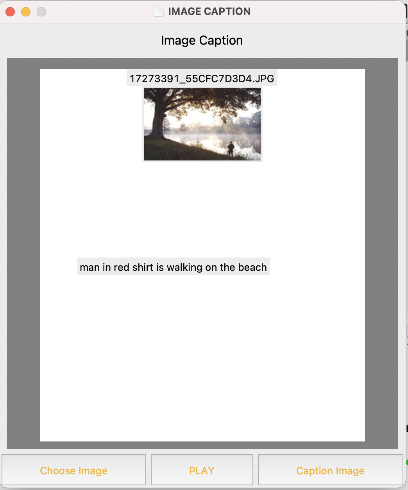

# Image Captioning 👨‍💻

### A image caption Deep learning model based on concept of CNN and LSTM with dataset of Flicker_8k and GUI🦿from tkinter.

---
 #### A `Convolutional Neural Network` is a Deep Learning algorithm which can take in an input image, assign importance to various aspects/objects in the image and be able to differentiate one from the other.
  The Flow structure of this method is like 
  
  

 In the last part of Classification we have used extended version of RNN i.e. `LSTM` which used stored memory and structure looks like 
 
 
 

---

### The DATASET CONTAINS IN THE FORM
| IMAGE | LABELS|
| :---  | :---: |
|| A child in a pink dress is climbing up a set of stairs in an entry way .   A girl going into a wooden building .  A little girl climbing into a wooden playhouse . A little girl climbing the stairs to her playhouse . 	A little girl in a pink dress going into a wooden cabin .

Dataset [Images Dataset Link](https://github.com/nikhil1221/image_labeling/tree/master/Dataset) and the [Text Dataset Link](https://github.com/nikhil1221/image_labeling/tree/master/text).

---

### Steps on the following Image labelling 
* Standard methods of Fetching and cleaning 

* Extracting features from the large dataset is going to take a lot of time if you don't have powerful GPU. It takes around 6-7 min on my machine. You can build feature on Google cloud platform with GPU machine and import the file been for further enquiry you can visit the platform https://colab.research.google.com/notebooks/gpu.ipynb
* Then the step of mapping the features and parameters with the text as we have to do it in parts and then merge it .
* Use of imbuilt models from the https://keras.io/api/applications/ For more Details Read the article on selection of model for based on depth, memory size, parameters. [LINK](https://towardsdatascience.com/how-to-choose-the-best-keras-pre-trained-model-for-image-classification-b850ca4428d4)
*  I have processed through 6 epochs you can do upto 10-12 for better training and filtering of parameters. 
 

--- 
### Output
A Gui that uses the model build from keras.applications that gives predict Xception

---

Tips:
 1. Use anaconda as environment as there are various issues that occur due to support. [website](https://www.anaconda.com/)
 2. Don't ever run large features on CPU unless you want to burn up.🥲
 3. Make seperate functions for even small activites 
 
 ---
 
All the files at points of computing are stored. Feel free to use at any point or for any query contact me - [Linkedin](https://www.linkedin.com/in/nikhil-chachan/)

A special Thanks to instagram and slow Network for this project idea. 😆 
